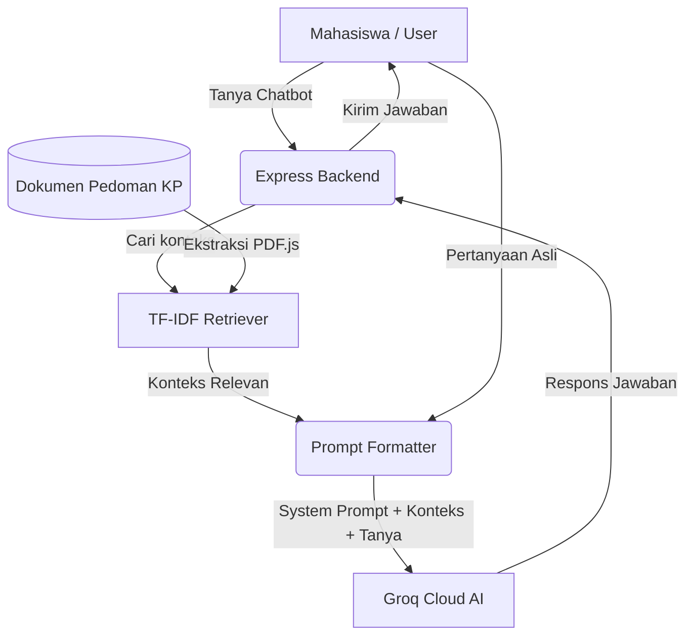

# 🤖 KPedia Chatbot - Sistem Informasi & Asisten Kerja Praktik (KP)
### 📍 Telkom University Surabaya

KPedia adalah aplikasi web RAG (*Retrieval-Augmented Generation*) Chatbot dan Smart Checklist Asisten Kerja Praktik (KP) yang dirancang untuk membantu mahasiswa Telkom University Surabaya dalam merencanakan, melaksanakan, dan menyelesaikan seluruh rangkaian proses Kerja Praktik.

🚀 **Link Live Demo:** [https://chatbot-kppedia.vercel.app](https://chatbot-kppedia.vercel.app)
📁 **Laporan Tugas Besar** (https://drive.google.com/file/d/1whF-B4obJa_s-M1RpihrZ1gftlrmmNsc/view?usp=sharing)

---

## 📋 Daftar Isi
1. [Fitur Utama](#-fitur-utama)
2. [Teknologi yang Digunakan](#-teknologi-yang-digunakan)
3. [Arsitektur Sistem](#%EF%B8%8F-arsitektur-sistem)
4. [Struktur Proyek](#-struktur-proyek)
5. [Instalasi Lokal](#-instalasi-lokal)
6. [Konfigurasi Environment](#-konfigurasi-environment)
7. [Panduan Deploy](#-panduan-deploy)

---

## 🌟 Fitur Utama

*   **RAG AI Chatbot:** Asisten AI yang menjawab pertanyaan mahasiswa seputar Kerja Praktik berdasarkan dokumen resmi `Pedoman KP.pdf` secara akurat dan kontekstual menggunakan LLM Llama 3.1.
*   **Cek Kelayakan KP (Eligibility Check):** Sistem verifikasi otomatis (SKS, IPK, status akademik, dan kelulusan mata kuliah prasyarat) untuk menentukan apakah mahasiswa sudah layak mengambil KP.
*   **Smart Checklist:** Panduan interaktif langkah-demi-langkah (workflow) pendaftaran, pelaksanaan, hingga pasca-KP. Mendukung fitur upload berkas bukti untuk diverifikasi oleh admin.
*   **Manajemen Akun & Profil:** Autentikasi aman menggunakan JWT (JSON Web Token) dan Google Sign-In, lengkap dengan fitur update foto profil dan data diri.
*   **Admin Panel (Back-office):** Panel khusus admin untuk memvalidasi berkas unggahan mahasiswa, memperbarui kriteria kelayakan KP, serta mengunggah/mengelola dokumen pedoman baru.

---

## 🛠️ Teknologi yang Digunakan

### **Frontend**
*   **Core:** HTML5, Vanilla CSS3 (Custom Glassmorphism & Dark Mode), Modern JavaScript (ES6+).
*   **UI Libraries:** [SweetAlert2](https://sweetalert2.github.io/) (Modals), [FontAwesome](https://fontawesome.com/) (Icons).
*   **Markdown Parser:** [Marked.js](https://marked.js.org/) (untuk merender respons Markdown dari AI).

### **Backend**
*   **Runtime & Framework:** Node.js, Express.js.
*   **AI & NLP:** [Groq SDK](https://console.groq.com/) (Model: `llama-3.1-8b-instant`), [Natural NLP](https://github.com/NaturalNode/natural) (TF-IDF Vector Retrieval untuk RAG lokal).
*   **PDF Reader:** [PDF.js](https://mozilla.github.io/pdf.js/) (untuk mengekstrak teks dari PDF pedoman saat inisialisasi).
*   **Security:** `bcrypt` (Hashing Password), `jsonwebtoken` (JWT Authentication), `google-auth-library` (OAuth Google).

### **Database & Storage**
*   **Database:** MySQL (menggunakan package `mysql2` dengan abstraksi query di [database.js](file:///Users/macbookpro/Documents/Web%20Developer/kppedia-chatbot/chatbot-kppedia/backend/database.js)).
*   **File Uploads:** `multer` untuk menangani unggahan berkas bukti dan gambar profil.

---

## ⚙️ Arsitektur Sistem

Berikut adalah alur kerja sistem RAG (*Retrieval-Augmented Generation*) pada KPedia:



---

## 📁 Struktur Proyek

```text
chatbot-kppedia/
├── backend/
│   ├── data/                   # File PDF pedoman KP untuk basis pengetahuan AI
│   ├── database.js             # Konfigurasi koneksi & inisialisasi tabel MySQL
│   ├── embedder.js             # Pengekstrak teks dari PDF
│   ├── retriever.js            # Algoritma TF-IDF untuk pencarian dokumen relevan
│   └── server.js               # Express Server utama (API Endpoints & Routing)
├── uploads/                    # Folder lokal untuk file upload mahasiswa
├── index.html                  # Landing Page
├── auth.html                   # Halaman Login & Registrasi
├── chatbot.html                # Dashboard Chatbot & Smart Checklist Mahasiswa
├── admin.html                  # Dashboard Khusus Admin
├── script.js                   # Logic Landing Page
├── auth.js                     # Logic Autentikasi Frontend
├── chatbot.js                  # Logic Utama Dashboard Mahasiswa
├── admin.js                    # Logic Utama Dashboard Admin
├── style.css                   # Desain CSS Utama (Sleek Dark Mode)
├── vercel.json                 # Konfigurasi Proxy API untuk Vercel Deployment
├── package.json                # Dependensi & Skrip Node.js
└── README.md                   # Dokumentasi Utama
```

---

## 💻 Instalasi Lokal

### 1. Prasyarat Sistem
*   Node.js versi 18 ke atas.
*   MySQL Server (XAMPP / Laragon / MySQL Installer).

### 2. Langkah Instalasi

```bash
# 1. Clone repositori ini
git clone https://github.com/chatbot-kppedia/chatbot-kppedia.git
cd chatbot-kppedia

# 2. Install dependensi proyek
npm install

# 3. Jalankan server lokal (Production Mode)
node backend/server.js

# Atau jalankan dengan hot-reload (Development Mode)
npx nodemon backend/server.js
```

Aplikasi dapat diakses di browser melalui: `http://localhost:3000`

---

## 🔑 Konfigurasi Environment

Buat file bernama `.env` di root direktori proyek, lalu isi dengan variabel berikut:

```env
GROQ_API_KEY=gsk_your_groq_api_key_here
GOOGLE_CLIENT_ID=your_google_client_id_here
GOOGLE_CLIENT_SECRET=your_google_client_secret_here
JWT_SECRET=your_jwt_secret_key_here

# Konfigurasi Database MySQL
DB_HOST=localhost
DB_USER=root
DB_PASSWORD=
DB_NAME=chatbot-kppedia
DB_PORT=3306
```

---

## ☁️ Panduan Deploy

Untuk mendeploy aplikasi fullstack ini secara gratis dan optimal, kami menyarankan metode **Hybrid Deployment**:

### 1. Database & Backend (Railway / Render.com)
*   Deploy database MySQL Anda ke cloud (bisa menggunakan **Aiven.io**, **Tidb Cloud**, atau **Railway**).
*   Deploy folder backend Anda ke **Render.com** atau **Railway** sebagai **Web Service**.
*   Masukkan semua konfigurasi `.env` ke bagian **Environment Variables** di dashboard hosting backend Anda.

### 2. Frontend (Vercel)
*   Hubungkan repositori GitHub Anda ke **Vercel**.
*   Buka file [vercel.json](file:///Users/macbookpro/Documents/Web%20Developer/kppedia-chatbot/chatbot-kppedia/vercel.json) di proyek Anda. Ubah alamat URL pada bagian `"destination"` dari URL mock ke URL backend Render/Railway Anda yang telah online (misal: `https://kppedia-backend.onrender.com`).
*   Deploy proyek tersebut di Vercel. Vercel akan otomatis menyajikan file statis (`index.html`, dll.) dan melakukan proxy request API ke backend Anda tanpa masalah CORS.

---

**Tim Pengembang Chatbot KPedia Telkom University Surabaya 🚀**
